# 
实验报告一

李沐遥 元培学院 2200017405 

## Task1:build your dataset
代码: [dataHelper.py](./dataHelper.py)
## Task2:Training Script
### Introduction
本实验中，我们对roberta-base, bert-base-uncased和scibert_scivocab_uncased三个模型进行微调，测试它们在restaurant_sup, acl_sup 和 agnews_sup三个文本分类数据集上分别微调之后的表现。
### Datasets
- restaurant_sup数据集：Aspect Based Sentiment Analysis任务，分析叙述者对谈话中对象的情感。分为positive，negative和natural三个labels。训练集大小为3452，测试集大小为1120。
- acl_sup数据集，分析一个段落在文章结构中的定位。分为Uses, Future, CompareOrContrast, Motivation, Extends, Background 6个类别。训练集大小为1688，测试集大小为139。
- agnew_sup数据集，分析一段报道属于什么类别。分为World, Sports, Business, Sci/Tech 4个类别。训练集大小为6840，测试集大小为760。
### Method
- config:
  - learning rate: $5*10^-5$
  - batchsize: 128
  - warmup_ratio: 0.15
  - lr_scheduler_type: cosine
### Results
- 详细数据:[results.xlsx](./results.xlsx)
- accuray:

| Model| restaurant_sup | acl_sup | agnews_sup |
|:-:|:-:|:-:|:-:|
| roberta-base| **0.86018** | 0.7822| **0.9308**     |
| bert-base-uncased        | 0.82589        | 0.75827 | 0.92579    |
| scibert_scivocab_uncased | 0.82982        | **0.81727** | 0.91921    |
#### 运行数据：
- roberta-base:
  - restaurant_sup: 15个epoch
  - 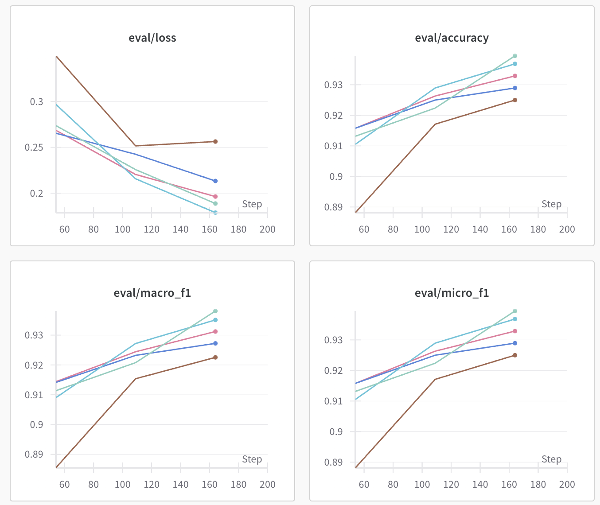
  - acl_sup: 12个epoch
  - 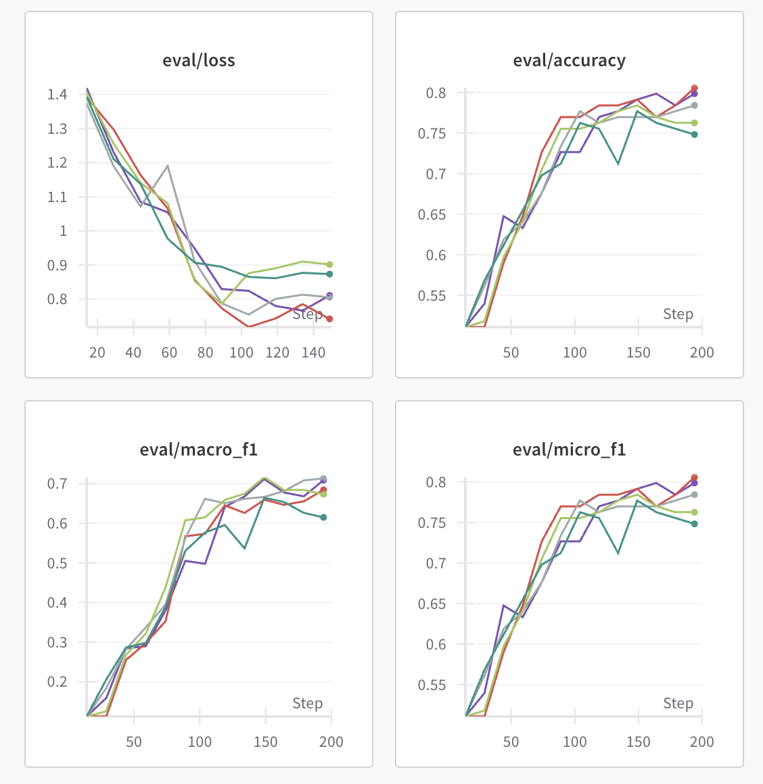
  - agnews_sup: 4个epoch
  - 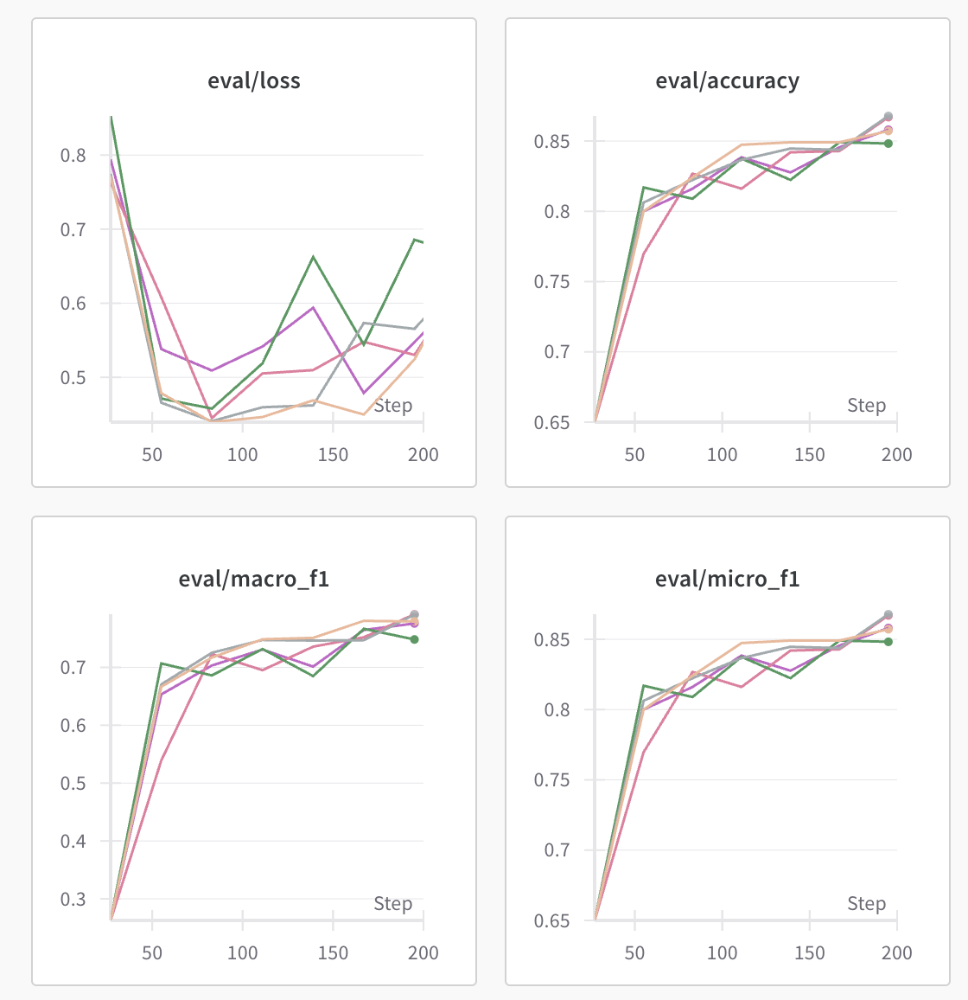
- bert-base-uncase
  - restaurant_sup: 15个epoch
  - 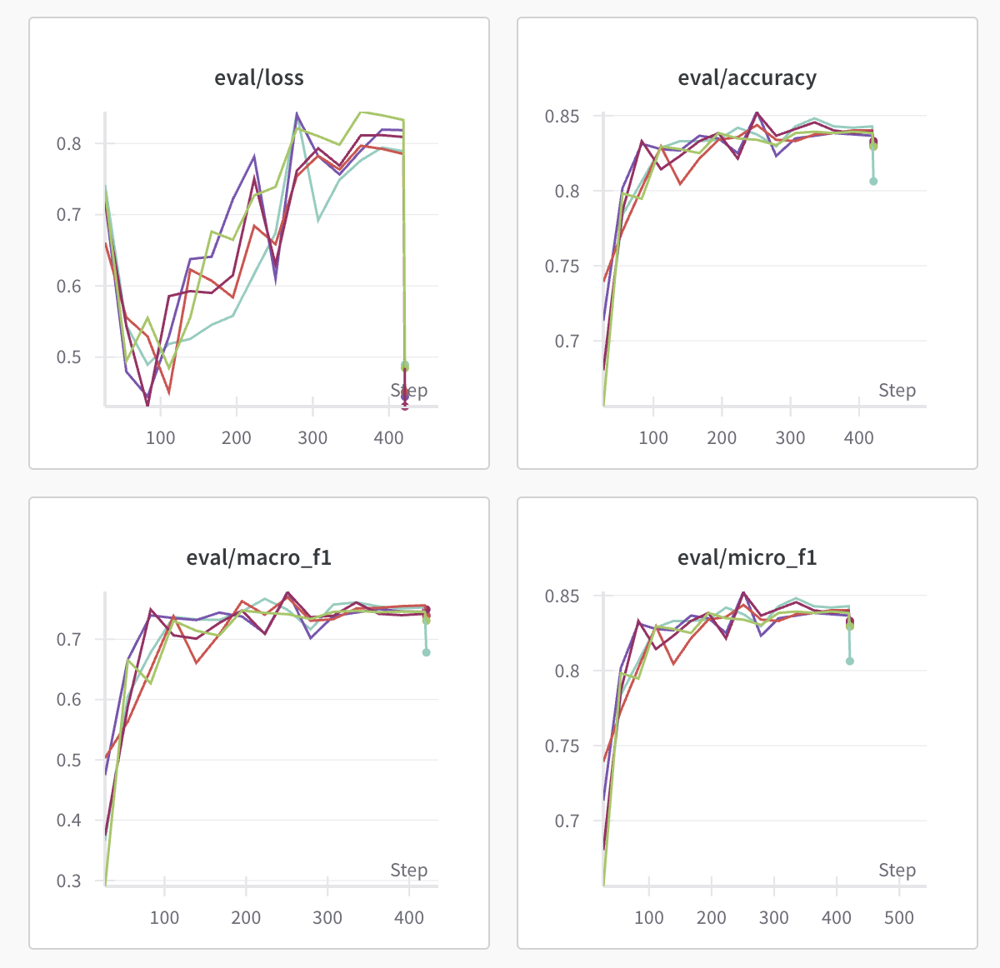
  - acl_sup: 15个epoch
  - 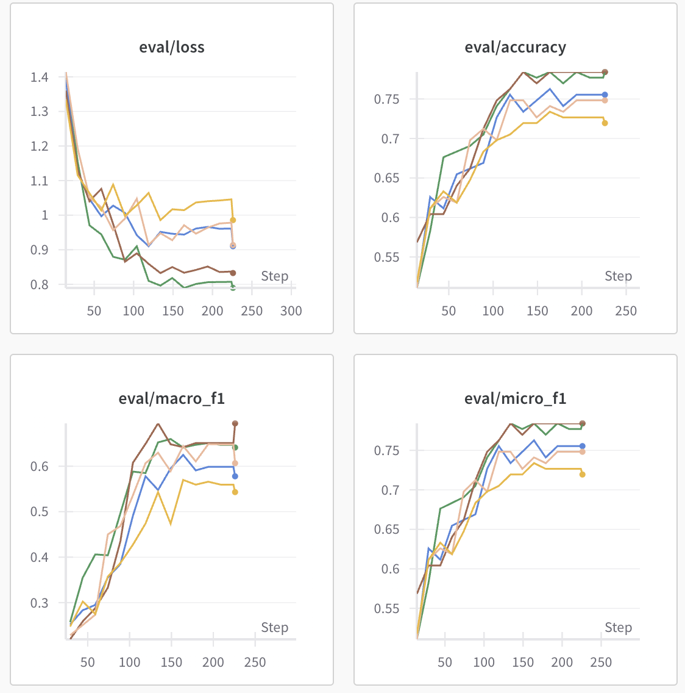
  - agnews_sup: 3个epoch
  - 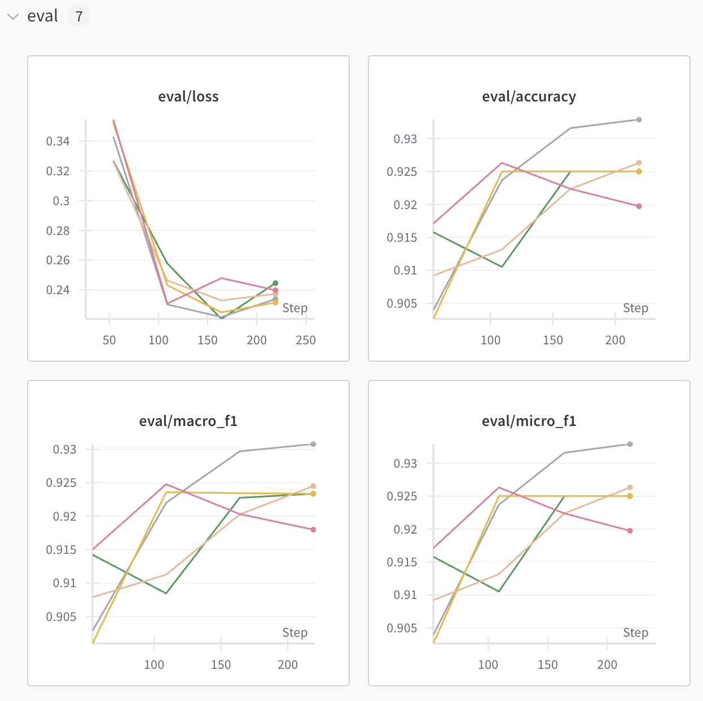
- sci
  - restaurant_sup: 15个epoch
  - 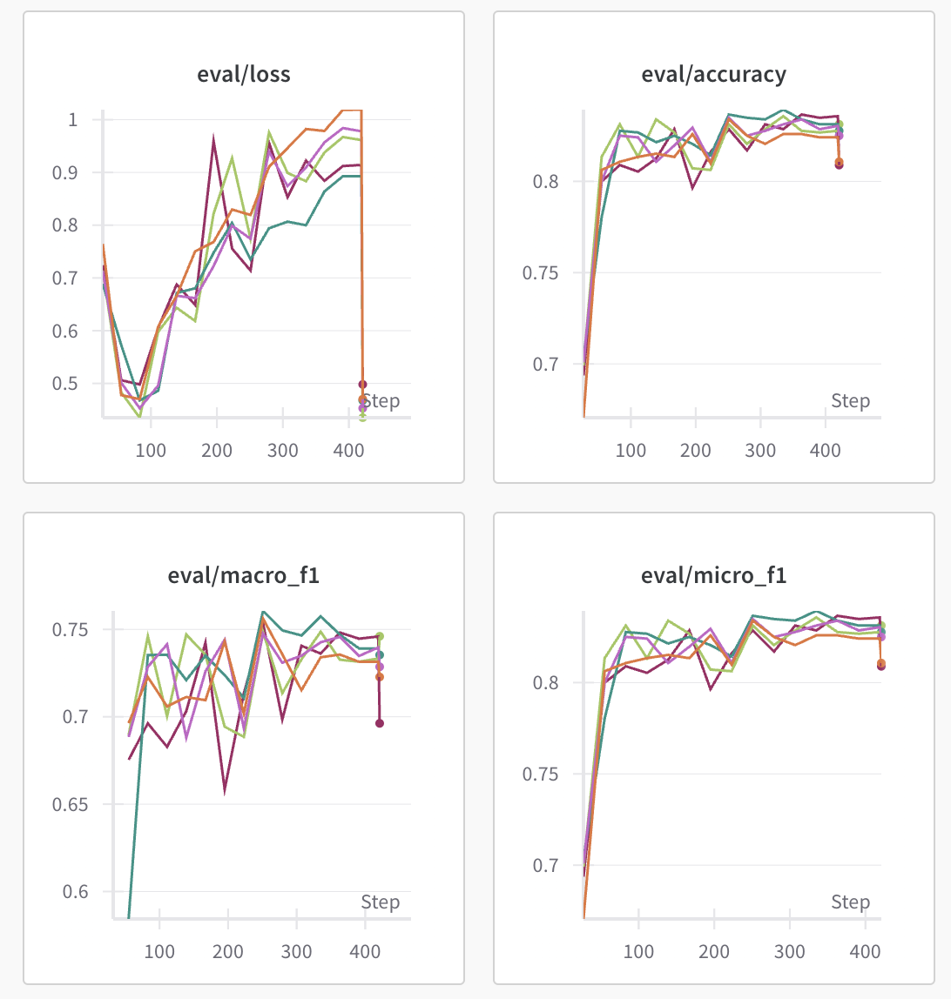
  - acl_sup: 15个epoch
  - 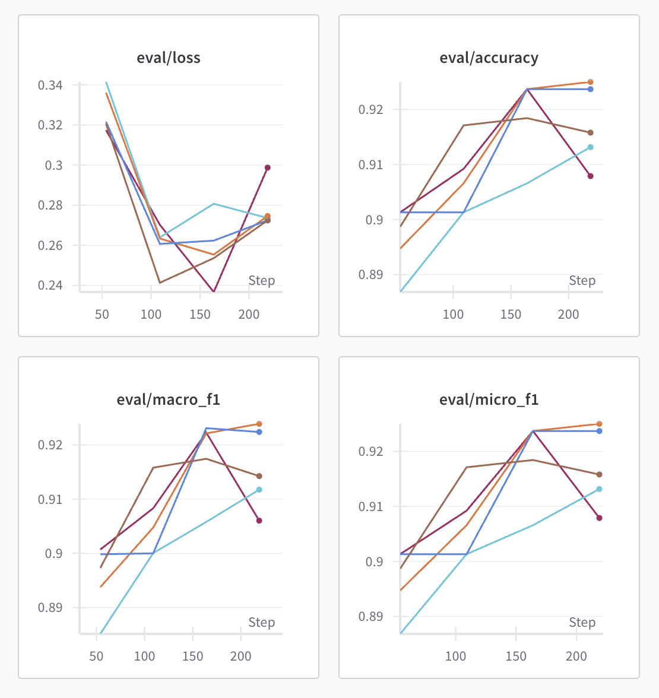
  - agnews_sup: 4个epoch
  - 
#### 统计数据：
我根据实验数据中eval loss, accuarcy, micro_f1和macro_f1四个matrix绘制了直方图，其中柱高代表均值，而柱状顶端的黑色误差棒则代表其方差。
  - loss
  - 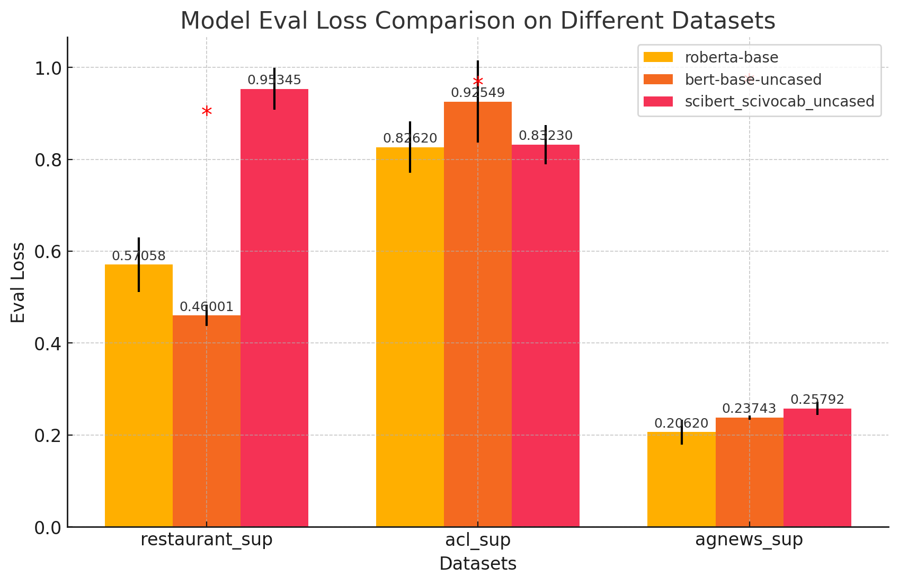
  - accuracy
  - 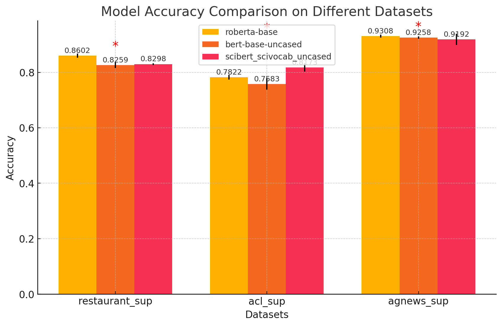
  - micro_f1
  - 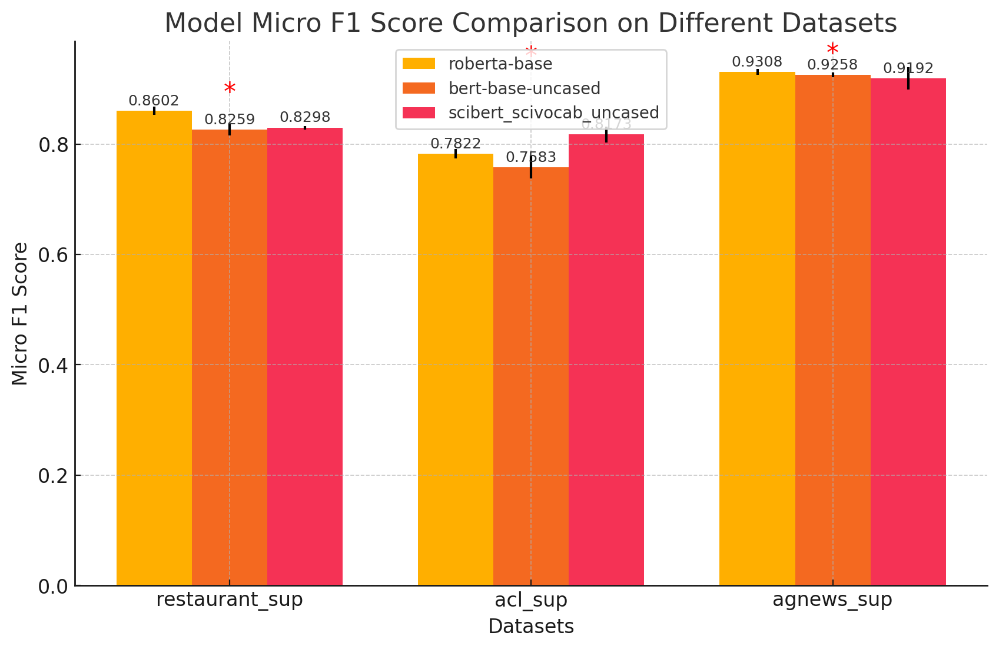
  - macro_f1
  - 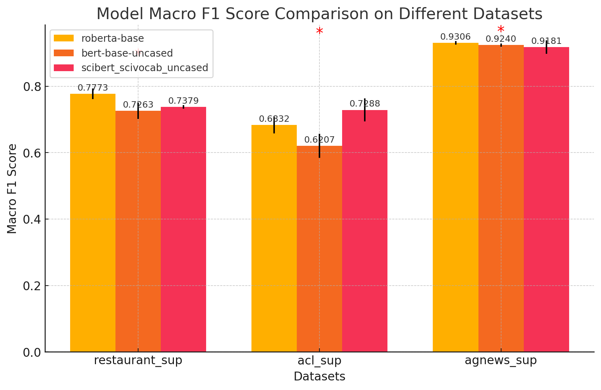
### Analyze
1. 整体而言，所有模型在acl_sup任务表现最差，在agnews_sup表现最好，且需要的epoch最少。这可能是因为acl_sup任务的类最多，但是数据只有1688训练数据；而agnews_sup任务有6840条训练数据有关。
2. roberta-base和scibert_scivocab_uncased的表现强于bert-base-uncased，其中roberta-base最佳。
3. 在我们使用的三个数据集中，accuracy一直等于micro_f1。
## task3: Finetuning adapter
### Introduction
在本实验中，我们采用adapter在restaurant_sup, acl_sup 和 agnews_sup三个数据集上对RoBERT进行分别微调，测试adapter相对于全参数微调对实验造成的影响。
### Method
使用huggingface的adapters类。在多头注意力层和FFN后加入adapters，采用gelu激活函数，并分别测试了模型在adapter隐藏层为8和64时模型的表现，具体参数如下：
- learning_rate：$1.4*10^{-4}$
- epoch：15
- batchsize：256
- warmup_ratio: 0.15
- lr_scheduler_type: cosine
### Results
- Adapter size : 64 
- tranable parameters: 2.818%

|Task|restaurant_sup|acl_sup|agnews_sup|
|:-:|:-:|:-:|:-:|
|loss|0.145|1.197|0.104|
|accuracy|0.816|0.626|0.934|
|micro_f1|0.816|0.626|0.934|
|macro_f1|0.691|0.280|0.933|

- Adapter size : 8
- tranable parameters: 1.227%

|Task|restaurant_sup|acl_sup|agnews_sup|
|:-:|:-:|:-:|:-:|
|loss|0.530|1.317|0.226|
|accuracy|0.778|0.511|0.932|
|micro_f1|0.778|0.511|0.932|
|macro_f1|0.558|0.113|0.928|

- 据此，我们可以画出Adapter size=8和Adapter size=64以及使用全参数微调的结果
  

### Discussion
#### efficiency
1. 如果要微调一个3B model，在不使用任何优化技术的情况下，假设数据格式为fp32，batch size为16，最大序列令牌数为1024：假设数据格式使用fp32：
   - 首先进行静态显存分析：前向传播需要占用2*3B=6GB的显存，反向传播产生的梯度也需6GB。优化器会存储模型副本及其一阶动量和二阶方差，每项各占6GB。共计30GB
   - 其次进行中间激活值分析，由于没有提供具体的模型架构，我们大概考虑按照llama3.2-3b的架构，即层数layer=28，词表大小为vocab_size=128256，隐藏向量hidden_size=3072, FFN中间层intermediate_size=8192，multi head attention(MHA) head number = 24。但为了简化计算，不考虑GQA和gate_projector
   - 令：
      > - batchsize:= b
      > - max_seq_tokens := s
      > - hidden_size := h
      > - head number := a
      > - hidden_dim_per_head := $h_a = h / a$  
      > - intermediate_size := i

   - 嵌入层：由于激活值是输入的 token，大小为 $2 \times b$，可以忽略不计。
   - 每层 Transformer 块：
	   - 多头自注意力机制 (MHA)：
      	- 计算 Q, K, V：激活值为输入的向量，大小为 $2 \times b \times s \times h$
      	- 计算 $QK^T$：需要保存 Q 和 K，大小为 $2 \times 2 \times b \times s \times h$
       	- 计算 $\text{softmax}(\frac{QK^T}{\sqrt{d}})$，激活值为 $QK^T$，大小为 $2 \times b \times s^2 \times a$
       	- 应用 dropout：需要保存 dropout 矩阵，大小为 $b \times s^2 \times a$
       	- 计算 $\text{softmax}(\frac{QK^T}{\sqrt{d}}) \times V$，需要保存注意力矩阵和 V，大小为 $2 \times b \times s^2 \times a + 2 \times b \times s \times h$
       	- 计算输出映射，激活值为 $\text{softmax}(\frac{QK^T}{\sqrt{d}}) \times V$，大小为 $2 \times b \times s \times h$
       	- 应用 dropout：大小为 $b \times s \times h$
       	- 每层总显存占用：$11 \times b \times s \times h + 5 \times b \times s^2 \times a$
      - 层归一化 (LN)：MHA 和 FFN 前后各一个，需要保存归一化值，大小为 $2 \times 2 \times b \times s \times h$
      - 前馈神经网络 (FFN)：
       	- 计算隐藏层 h：激活值为输入，大小为 $2 \times b \times s \times i$
       	- 计算激活函数：激活值为隐藏向量，大小为 $2 \times b \times s \times i$
       	- 计算下行矩阵映射的结果：大小为 $2 \times b \times s \times i$
       	- 应用 dropout：大小为 $b \times s \times h$
      - 每层总计：$4 \times b \times s \times i + 3 \times b \times s \times h$
      - 输出层，激活值为输入向量，大小为 $2 \times b \times s \times h$
	- 总计：$\text{layers} \times (18 \times b \times s \times h + 5 \times b \times s^2 \times a + 4 \times b \times s \times i) = 432 \times b \times s \times h + 140 \times b \times s^2 \times a + 112 \times b \times s \times i \approx b \times 5.5 \text{GB} = 88\text{GB}$
   - 综上，部署显存大概要占用30GB，而中间激活值要占用88GB显存，总计118GB显存左右
1. 如果使用adapter，仍然假设数据格式使用fp32，并且不使用其他任何优化方法，batch size为256，token max_length为1024，adapter中间大小r为64，并且在MHA和FFN后面都加入adapter
   - 参数量估算：按照本次实验使用的RoBERTa模型进行估算，可学习参数大概占总参数3%
   - 进行静态静态显存分析：前向传播需要占用2*3B=6GB的显存，反向传播也需要保留所有梯度6GB，而优化器只需要保存adapter参数和动量与方差就好，占用6GB*3*0.03=0.54GB的参数，总计12.54GB
   - 中间激活值显存分析：对1个adapter模型来说，上采样矩阵需要保存输入向量x，占用2bsh显存；激活层需要保存隐藏层向量，占用2bsr显存；下采样矩阵需要保存经过激活层的隐藏向量，占用2bsr显存；最后经过dropout层，占用bsh显存，总计3bsh+4bsa，这样大约是b*0.5GB显存，在batchsize=16的情况下占用8GB显存
   - 总计20GB左右显存

由此分析，使用adapter后总的参数量可以下降到原本的15%左右，因此adapter对优化空间复杂度意义极大
#### performance
- 结合任务二，可以对微调模型表现进行分析：

| Model| restaurant_sup | acl_sup | agnews_sup |
|:-:|:-:|:-:|:-:|
| roberta-base|**0.86018**|**0.7822**|0.9308|
|r=64|0.816|0.626|**0.934**|
|r=8|0.778|0.511|0.932|

- 全参数微调的效果普遍优于或近似于adapter微调，agnews_sup任务用adapter表现甚至更好，这可能与adapter微调进行了更多轮的训练，并且学习率更大有关。
- 实验发现，对于困难任务(acl_sup)，使用更大的adapter size会对实验效果更有帮助；而对于简单任务，使用更小的adapter size表现不会下降太多，并且效率会更高。

#### addition
- 值得注意的点是，在所有实验中accuracy和micro_f1的结果一样，起初我以为是代码错误，但是实际上这并非巧合。下面是原因分析：
  - 由于micro_f1计算的是所有类总共的precision和recall。而在分类任务中，参考答案的长度是和答案一样长的，因此tp+fp=tp+fn,进而有precision=recall，根据f1的公式：
  $$micro_{f1} = \frac{2*precision*recall}{precision+recall}$$ 
  - 可以推得$micro_{f1}=precision$,而accuracy=precision，所以micro_f1和accuracy大小相同。